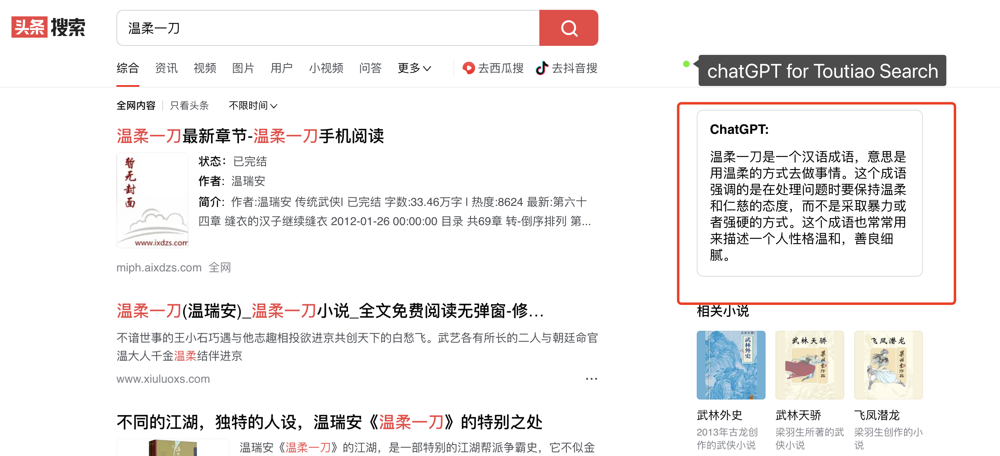

# ChatGPT for Search

A browser extension to display ChatGPT response alongside **Google/Baidu/Toutiao/Bing** Search results.

## Credit

This project is based on [wong2/chat-gpt-google-extension](https://github.com/wong2/chat-gpt-google-extension) and brings the same functionality to **Baidu/Toutiao/Bing** Search.

## Installation

### Install to Chrome/Edge

1. Download `build.zip` from [Releases](https://github.com/doragd/chat-gpt-search-extension/releases)
2. Unzip the file
3. In Chrome/Edge go to the extensions page (`chrome://extensions` or `edge://extensions`).
4. Enable Developer Mode.
5. Drag the unzipped folder anywhere on the page to import it (do not delete the folder afterwards).

## Build from source

1. Clone the repo
2. Install dependencies with `npm`
3. Run `./build.sh` for Chrome
4. Load the `build` directory to your browser

